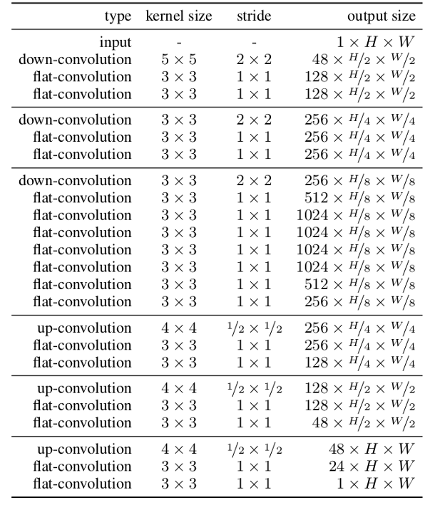

# Line Art to Simple Vector Line Art
- Made by Jung
## Reference
- https://github.com/ishanrai05/rough-sketch-simplification-using-FCNN

## Dataset
- Inputs : 
    - Info : Line Art by Painter  
    - Size : Transform to 1024x1024 
    - Channel : Grayscale Image 
    - DType : ``torch.Tensor``
    - Count : 100

- Outputs : 
    - Info : Rough Line Art from Flat Coloring Image
    - Size : Transform to 1024x1024 
    - Channel : Grayscale Image 
    - DType : ``torch.Tensor``
    - Count : 100

## Model Architecture

## Depedency
- Python3.x(I used python 3.11.0 in conda)
- CUDA 11.8(CPU is OK But very Long time... if you will use CPU install torch, torchvision CPU version), GPU VRAM 18GB(batch_size=4)
- ``pip install --no-cache-dir torch==2.0.1+cu118 torchvision==0.15.2+cu118 --index-url https://download.pytorch.org/whl/cu118``
- ``pip install -r requirements.txt``

## Used
- ⭐️ Changed PATH Your Environments
- ``python main.py``